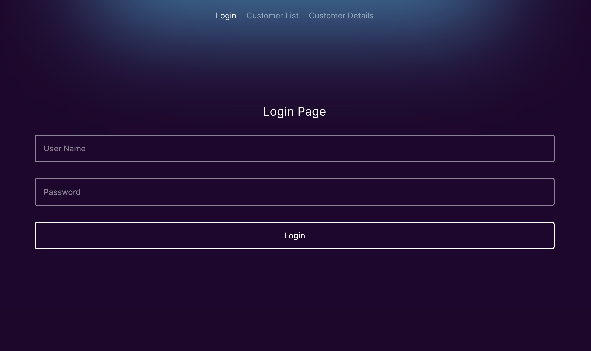
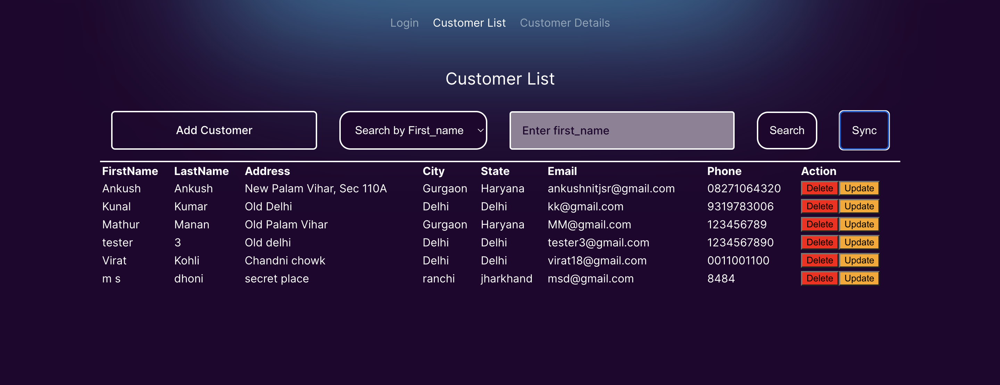
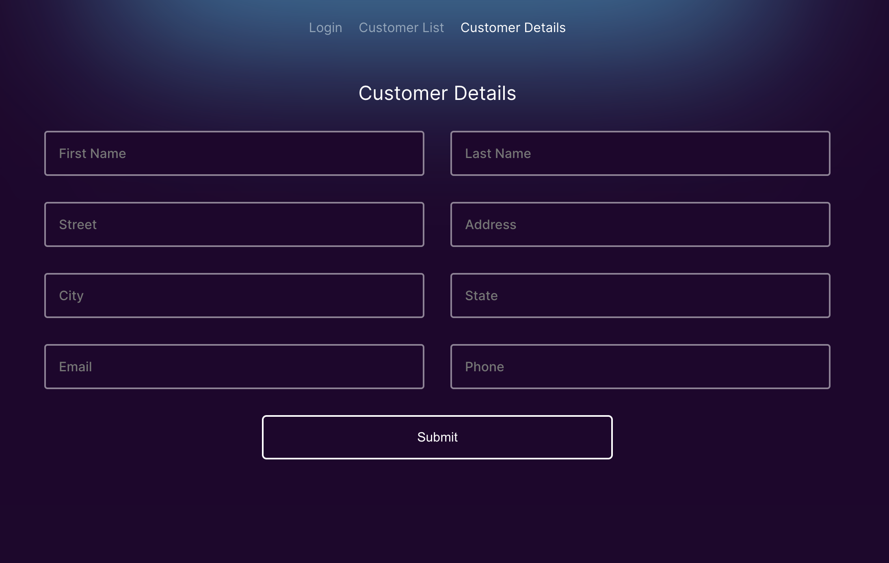
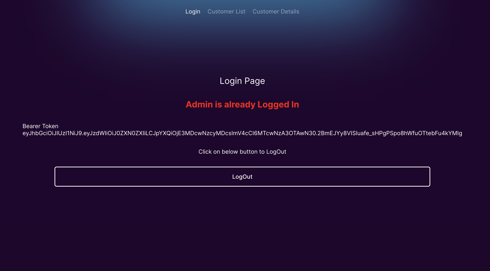

# Customer Relationship Manager (ReactJS)

The Customer Relationship Manager is a web application developed with ReactJS for the frontend and Spring Boot for the backend. It provides a user interface for managing customer details, with features like login, customer display, customer creation, and data synchronization.

## Table of Contents

- [Features](#features)
- [Technologies Used](#technologies-used)
- [Project Structure](#project-structure)
- [Getting Started](#getting-started)
- [Frontend](#frontend)
- [Backend](#backend)
- [API Endpoints](#api-endpoints)
- [Authentication](#authentication)
- [Sync Data](#sync-data)
- [Contributing](#contributing)
- [License](#license)

## Features

1. **Login Screen:**

   - Users can log in to the application.
   - JWT token is obtained on successful login.

2. **Customer Details Display Screen:**

   - Displays a list of customer details.
   - Uses Redux for state management.
   - Allows synchronization of data with a remote API.

3. **Customer Details Input Screen:**

   - Enables users to input details and create a new customer.
   - Utilizes React Router DOM for multiple screens.

4. **JWT Authentication:**

   - Backend built with Spring Boot.
   - JWT-based authentication for secure API access.
   - Bearer Token used for subsequent API calls.

5. **Data Synchronization:**
   - Sync button triggers a remote API call to update customer details.
   - Updates reflected in the application in real-time.

## Technologies Used

- **Frontend:**

  - ReactJS
  - Redux for state management
  - React Router DOM for navigation

- **Backend:**

  - Spring Boot
  - JWT-based authentication
  - Spring Security

- **Database:**
  - MySQL

### Screenshots:

- **Login Screen:**
  

- **Customer Details Display Screen:**
  

- **Customer Details Input Screen:**
  

- **LogOut Screen:**
  
